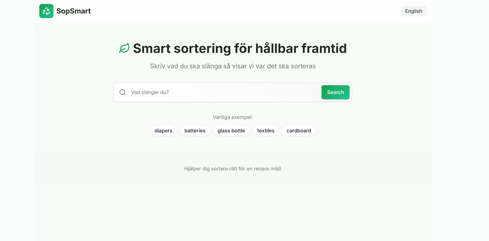
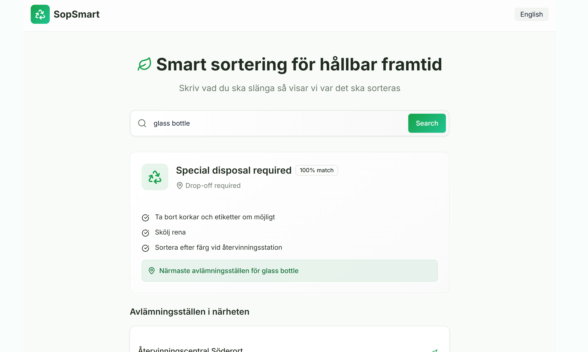
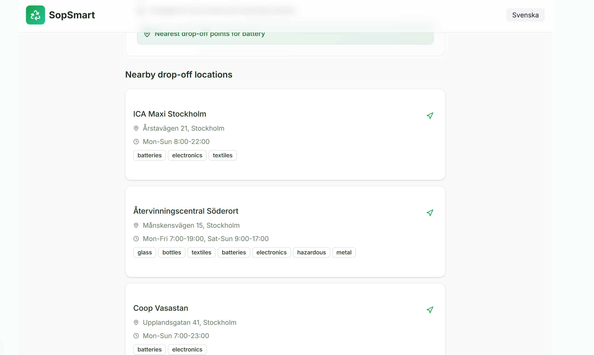
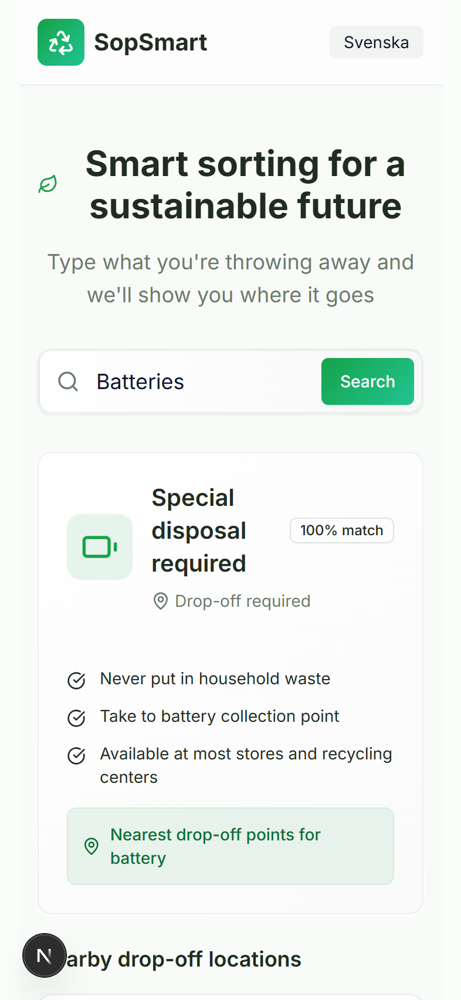

# ♻️ SopSmart

_A Nordic-inspired smart waste sorting app built with React, Next.js, TypeScript, and TailwindCSS_

---

## 🌍 Overview

**SopSmart** is a clean, modern web app that helps people in Sweden (and beyond) understand how to sort their waste.  
It combines a **Google-style search interface** with **smart material recognition** and **drop-off station guidance**.

The design is inspired by Scandinavian minimalism — clean whites, forest greens, and an eco-friendly aesthetic.  
Think of it as a **trustworthy, government-service–like tool with modern UX**.

---

## ✨ Features

- 🔎 **Smart Search**

  - Type any item (English or Swedish) and get disposal instructions
  - Confidence scoring to indicate match quality
  - “Did you mean…?” suggestions for low-confidence queries

- 🏡 **At-Home Sorting Instructions**

  - Clear bin categories (e.g. residual waste, paper recycling)
  - Easy-to-read bilingual guidance

- 🗺 **Drop-off Location Finder**

  - Nearby stations with names, addresses, and hours

- 🌐 **Bilingual Support**

  - Toggle between English and Swedish

- 🎨 **Design Vision**

  - Nordic-inspired aesthetic (forest greens, clean whites, earth tones)
  - Sustainability-themed iconography
  - Smooth animations for a modern feel

- 📱 **Responsive**
  - Works seamlessly on mobile, tablet, and desktop

---

## 🖼️ Demo

### Hero Section



### Search Example



### DropOff locations Example



### Mobile version Example



---

## 🛠️ Tech Stack

- [Next.js](https://nextjs.org/) (App Router)
- [React](https://react.dev/) + [TypeScript](https://www.typescriptlang.org/)
- [TailwindCSS](https://tailwindcss.com/) + [shadcn/ui](https://ui.shadcn.com/)
- [Lucide Icons](https://lucide.dev/) for clean eco-themed iconography
- Mock data for materials & recycling stations

---

## 📦 Getting Started

### Prerequisites

- Node.js 18+
- npm (or yarn/pnpm)

### Installation

```bash
# Clone the repo
git clone https://github.com/AnnaBilokon/SopSmart
cd SopSmart

# Install dependencies
npm install

# Run the dev server
npm run dev
```

# Open locally

Open http://localhost:3000 in your browser.
